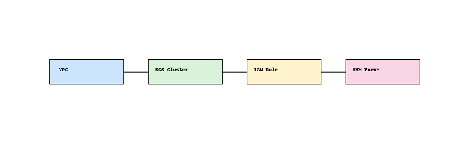

# IaC Patterns with CDK 🏗️📦

Reusable AWS CDK patterns for quickly deploying infrastructure components.

## 🧩 Patterns Included

- VPC with public/private subnets
- ECS Cluster with ALB
- IAM Role & Policy
- SSM Parameter integration

## 🗺️ Architecture



## 📁 Structure

- `lib/patterns/` – CDK constructs for VPC, ECS, IAM, and SSM
- `bin/` – CDK entry point
- `README.md` – Project overview and deployment instructions

## 🚀 Deployment

```bash
cd cdk-app
npm install
cdk bootstrap
cdk deploy
```
